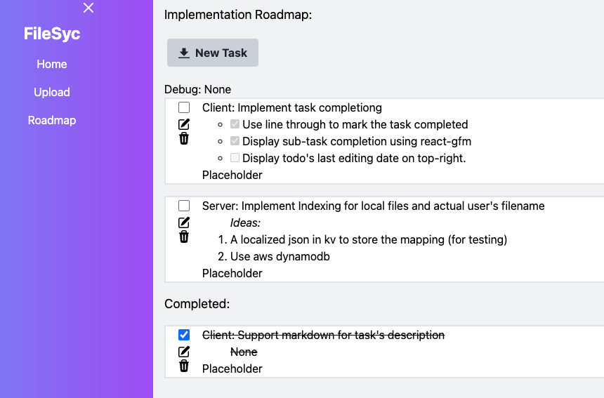
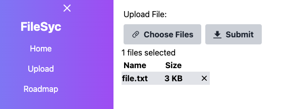
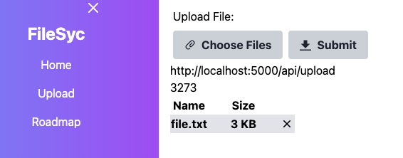

# filesync-client
This is the frontend implementation of FileSync using Nextjs and Typescript. Also, a simple but functional todo list for project progression is embedded in this project. 

So far, the project is aimed for single user only

## Things already done:
- A todo list that implements:
    - Rest Api include: Get (Fetch all task), Put (Add new task or update existing task), and Delete (delete chosen task)
    - Embedded markdown display for task description using React-markdown
    

- A file upload page that implements:
    - File selection from operating system for pending upload, a list display is provided that shows file size and allow for deletion.
    
    - Rest Api for upload files to server and accept total bytes uploaded as return result 
    

## Implementation Idea
- Support Dark theme!!!!
- Add more features to Todo list, such as
    - [ ] Tags, so there is no need to annotate in the title
    - [ ] More helpful information such as "data completed" or "Priority Ranking"
    - [ ] A redesign task's card design. 
- List page: The **Get** and **Delete** Api for files stored in the server.
    - [ ] Get
    - [ ] Delete
- Login page: Ideally using Oauth2 or even SSO
- Configuration page: 
    - The ability to configure multiple destination for file storage, such as AWS S3, Google drive etc.
    - The ability to connect multiple account.

## Acknowledge
- The CSS style was adopted from dotnet's **blazorserver** template.
- The card item design for todo is inspired from [dribbble/Disy]("https://dribbble.com/shots/17884346-Disy-Task-management")